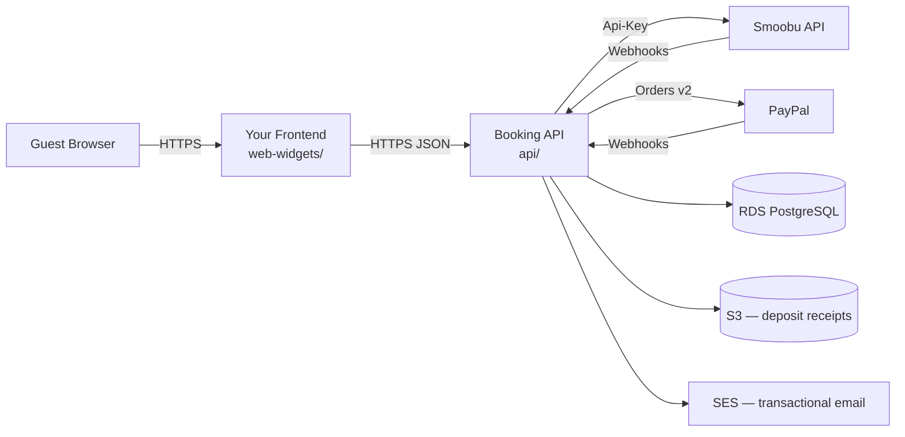
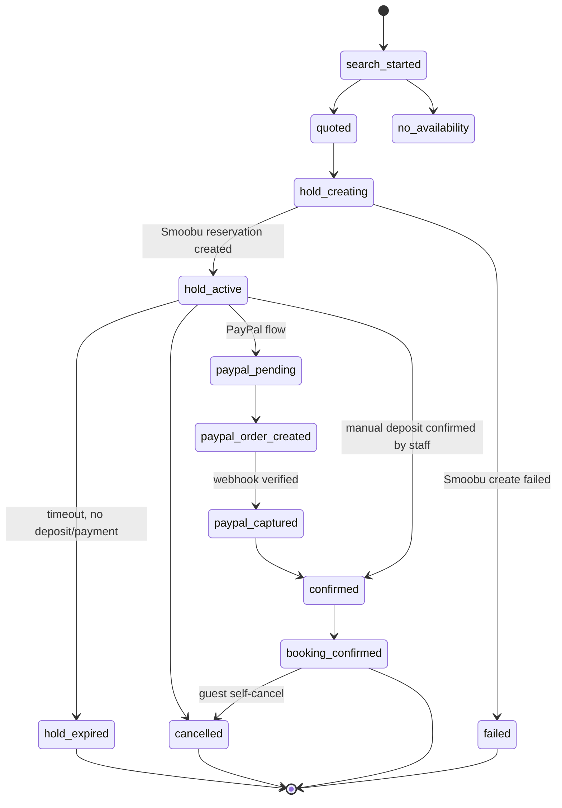

# AGENTS.md — implementation guide for AI coding agents

This file is written for an AI coding agent (Claude Code, Codex, Cursor, etc.)
tasked with wiring this booking engine into someone else's Smoobu-connected
vacation rental site. Read this whole file before writing code. It is the
single source of truth for architecture, data model, API contract, and the
things that will quietly break if you skip them.

If you are a human: this is also a fine README for you, just denser than
usual.

## What this is

A production-grade custom booking engine that replaces Smoobu's embedded
booking widget with your own UI, backed by a Node/TypeScript API that proxies
Smoobu, PayPal, and (optionally) manual bank-transfer/SINPE deposits. It
implements the pattern Smoobu itself recommends: **never call the Smoobu API
from the browser**, keep a durable state machine in your own database, and
reconcile with Smoobu via webhooks instead of trusting the browser's last
known state.

What you get:

- `api/` — a Lambda/API Gateway-compatible TypeScript backend: availability
  search, hold creation, PayPal orders/capture, manual deposit holds + staff
  confirmation, guest portal, Smoobu/PayPal webhook ingestion, calendar price
  data, hold-expiry and payment-reconciliation workers. ~500 tests.
- `web-widgets/` — two portable React components (`CalendarWithPriceDots`,
  `BookingSearchWidget`) plus a full reference checkout page in `examples/`
  showing how everything wires together end to end.
- `infra/` — a Terraform module for the AWS side: API Gateway, five Lambda
  functions, RDS PostgreSQL, Secrets Manager, S3 (deposit receipts),
  CloudWatch alarms, WAF, SES, and an optional CloudFront-fronted frontend
  bucket.

What you do **not** get, on purpose: an admin panel, automated refunds, or
support for payment providers other than PayPal + manual deposit. See
[Non-goals](#non-goals-and-known-limitations).

## Repository layout

```
api/                    Backend — deploy this to Lambda (or run as a Node server)
  src/                  All TypeScript source. One file per concern, one
                        matching *.test.ts per file for most of them.
  migrations/           Numbered, forward-only SQL migrations (0001…0016)
  scripts/              Local dev tooling (mock providers, migration runner)
web-widgets/
  src/components/CalendarWithPriceDots/   Portable — no page-level coupling
  src/components/BookingSearchWidget/     Portable — no page-level coupling
  src/hooks/, src/services/, src/utils/   Supporting code the two components need
  examples/Booking.page.tsx               Full reference checkout flow (adapt, don't drop in)
infra/
  *.tf                  Terraform module (VPC, RDS, Lambda, API Gateway, WAF, SES, CloudFront)
  environments/example.tfvars
  backend.hcl.example
docker-compose.yml       Local Postgres + MinIO (S3 stand-in) for dev
```

## Architecture



The frontend never holds a Smoobu API key, a PayPal secret, or a database
connection string. Every write (create hold, capture payment, cancel booking)
goes through `api/` and is validated against Smoobu's live availability
immediately before it happens — the browser's idea of "available" is never
trusted at write time.

## Booking state machine



The full status union lives in `api/src/bookingSessions.ts` as
`BookingSessionStatus`. Two invariants matter more than the diagram:

1. **Smoobu is the locking authority.** A hold is not "you have first refusal
   in our database" — it is a real Smoobu reservation on the blocked channel
   (channel ID 11 by default), created via `POST /api/reservations` the
   moment a guest starts checkout. This is what prevents double bookings
   across your other channels (Airbnb, Booking.com, walk-ins entered directly
   in Smoobu).
2. **Payment confirmation only ever happens server-side**, triggered by a
   signature-verified PayPal webhook (`PAYMENT.CAPTURE.COMPLETED`) or an
   authenticated staff action (manual deposit). The frontend can *display*
   "your payment is confirmed" but can never *cause* that state — there is no
   endpoint that lets the browser assert its own booking is paid.

## Data model

Core tables (see `api/migrations/000*.sql` for exact DDL):

| Table | Purpose |
| --- | --- |
| `properties` | Your property catalog: Smoobu apartment ID, slug, display name, amenities, thumbnail. Seeded by `0002_properties.sql` + `0010_seed_properties.sql`. |
| `booking_sessions` | One row per guest attempt: dates, guests, quoted properties, status, language, guest contact info. |
| `holds` | One row per hold attempt, holding the Smoobu reservation ID once created, TTL, and status. |
| `payments` | PayPal order/capture IDs and amounts. |
| `webhook_events` | Dedupe store for PayPal event IDs and Smoobu webhook deliveries — a UNIQUE constraint is what makes webhook processing idempotent. |
| `idempotency_keys` | Backs the `Idempotency-Key` header enforcement on public write endpoints. |
| `audit_log` | Append-only record of security-relevant actions. |

`propertyCatalog.ts` is the **in-memory** mirror of the `properties` table
that request handlers actually read from — it is not queried from the
database on the hot path. Keep the two in sync when you replace the demo
catalog (see [Configuration surface](#configuration-surface)).

## API reference

All routes are defined in `api/src/routes.ts`. `abuseProtection` names map to
per-route rate-limit/CAPTCHA policies in `api/src/abuseProtection.ts`.

| Method | Path | Purpose |
| --- | --- | --- |
| GET | `/api/health` | Liveness check. |
| POST | `/api/search` | Availability search across the whole portfolio for a date range + guest count. Never blocks on the date being pickable — an empty result set is a valid, expected response. |
| GET | `/api/exchange-rate` | Cached USD→CRC display rate (Spanish UI only; nothing is ever charged in colones). |
| GET | `/api/calendar/:apartmentSlug` | Per-day price + availability + month stats for one property's calendar (price-dot data). |
| POST | `/api/holds` | Creates a PayPal-path hold: revalidates Smoobu availability, creates the Smoobu reservation, persists the local hold. |
| POST | `/api/paypal/order` / `/api/bookings/:id/paypal/create-order` | Creates a PayPal order for an existing hold. |
| POST | `/api/paypal/capture` / `/api/bookings/:id/paypal/capture` | Captures the PayPal order and, on success, transitions the booking toward `confirmed`. |
| POST | `/api/deposit-holds` | Creates a manual-deposit hold (bank transfer / SINPE) — a real Smoobu reservation, same as the PayPal path. |
| GET/POST | `/api/staff/deposit-review/:token` | Signed one-click staff confirm/reject link. GET renders a read-only review page; POST performs the action. Deliberately split so email link-preview bots can't confirm bookings by prefetching the GET. |
| GET/POST | `/api/deposit-handoff` | Manual-deposit contact instructions and click tracking (used when a portfolio hasn't set up bank details yet). |
| POST | `/api/deposit-receipt/upload-url` / `/api/deposit-receipt/confirm` | Presigned S3 upload flow for the guest's transfer receipt. |
| POST | `/api/webhooks/paypal` | PayPal webhook receiver. Verifies signature before touching any state. |
| POST | `/api/webhooks/smoobu` | Smoobu webhook receiver. No query-string secret (header-based instead), deduped via `webhook_events`. |
| POST | `/api/portal/login` | Guest portal login (reservation ID + password). |
| GET | `/api/portal/reservation/:id` | Guest's own reservation summary. |
| POST | `/api/portal/reservation/:id/cancel` | Guest self-service cancellation, subject to the cancellation policy window. |
| POST | `/api/portal/reservation/:id/help-request` / `/cancellation-request` | Guest messages to staff. |
| PUT | `/api/portal/reservation/:id/guests` | Guest count update on an existing reservation. |

Every public write endpoint requires an `Idempotency-Key` header and is
subject to per-IP + per-device rate limiting (`X-Booking-Device-Id` header —
generate a random persistent ID client-side, it does not need to be
cryptographically strong).

## Integration playbook

Follow these steps in order. Each one names the exact files to touch.

### 1. Stand up local infrastructure

```bash
docker compose up -d
cd api
cp .env.example .env
cp .env.local.example .env.local
npm install
npm run migrate:local
npm run dev              # mock Smoobu/PayPal + booking API on :4000
```

Smoobu has no sandbox environment, so local development always runs against
`scripts/mockProviders.js`, not the real Smoobu API. Point a real request at
Smoobu and it will actually block dates on a live property.

### 2. Replace the demo property catalog

Edit **both** of:
- `api/src/propertyCatalog.ts` — the array the request handlers read.
- `api/migrations/0010_seed_properties.sql` — the DB seed (write a new
  numbered migration instead of editing this one if it has already run
  anywhere; see `api/README.md`'s migration rules).

For each property you need: your own stable `propertyId` (any unique
string), the real Smoobu `smoobuApartmentId` (visible in the Smoobu
dashboard URL when you open an apartment), a URL-safe `slug`, guest capacity,
a thumbnail URL, and an amenities list (the `pet` amenity code drives the
pet-friendly filter — add it only to properties that actually accept pets).

Mirror the same slugs and display names in
`web-widgets/src/utils/constants.ts` (`PROPERTY_DISPLAY_NAMES`,
`MAX_PORTFOLIO_GUESTS`, `PROPERTY_LOCATIONS`) if you use the reference
checkout page.

### 3. Set your brand name and contact info

- `api/src/branding.ts` — one `SITE_NAME` constant used in emails, the PayPal
  statement descriptor, and internal Smoobu reservation notices.
- `CONTACT_WHATSAPP_URL` / `CONTACT_EMAIL` env vars — guest-facing contact
  info in deposit instructions and emails.
- `web-widgets/examples/Booking.i18n.ts` — all guest-facing copy, EN and ES.
  Search for `Your Rental Co` and replace it; it is a placeholder, not a
  config value, because most of this file is prose you'll want to rewrite
  anyway.

### 4. Configure secrets

Real deployments never read secrets from environment variables — see
`api/README.md`'s Secrets Manager JSON shape. You need, at minimum: a Smoobu
API key (Smoobu dashboard → Apps → API), a PayPal REST app (sandbox first),
and a webhook signing secret you invent for the Smoobu webhook header.

### 5. Wire up the frontend

`CalendarWithPriceDots` and `BookingSearchWidget` are genuinely portable —
they only depend on the sibling files in `web-widgets/src/` (services,
hooks, utils), none of which are brand-specific. Drop the whole
`web-widgets/src/` tree into your app and import the two components directly.

The reference checkout page in `web-widgets/examples/Booking.page.tsx` is
**not** meant to be dropped in unmodified — it is 1200+ lines demonstrating
the full search → hold → pay → confirm → portal flow, with a placeholder
`<SiteHeader />` standing in for whatever navigation your site already has.
Read it end to end, then either adapt it or use it purely as a reference for
wiring your own page against the same `BookingApi.service.ts` client.

Required frontend env vars: `REACT_APP_BOOKING_API_BASE_URL`,
`REACT_APP_CAPTCHA_SITE_KEY` (must be the same CAPTCHA provider —
`recaptcha` or `hcaptcha` — as `CAPTCHA_PROVIDER` on the backend, or every
challenge silently fails to clear).

### 6. Deploy infrastructure

```bash
cd infra
cp environments/example.tfvars environments/dev.tfvars   # fill in real values
cp backend.hcl.example backend-dev.hcl                    # fill in real values
terraform init -backend-config=backend-dev.hcl
terraform plan  -var-file=environments/dev.tfvars
terraform apply -var-file=environments/dev.tfvars
```

Bootstrap the state bucket/table first — see the comment block at the top of
`infra/main.tf`. `infra/MIGRATION_RUNBOOK.md`-style region migrations are out
of scope here; this module assumes a fresh deploy into one region.

### 7. Point Smoobu and PayPal at your webhooks

- Smoobu: dashboard → Apps → Webhooks → point at
  `https://<your-api-domain>/api/webhooks/smoobu`, header
  `X-Smoobu-Webhook-Secret` matching your Secrets Manager value.
- PayPal: Developer Dashboard → your app → Webhooks →
  `https://<your-api-domain>/api/webhooks/paypal`, subscribed to at least
  `CHECKOUT.ORDER.APPROVED` and `PAYMENT.CAPTURE.COMPLETED`.

## Configuration surface

Everything that should differ per deployment is a config value, not a code
change. If you find yourself editing logic (not data) to adapt this to a new
site, something is missing from this list — treat it as a bug in the
extraction and generalize it rather than hardcoding your new business's data
the same way the original did.

| What | Where |
| --- | --- |
| Property catalog | `api/src/propertyCatalog.ts` + `api/migrations/0010_seed_properties.sql` |
| Brand name | `api/src/branding.ts` |
| Guest-facing copy (EN/ES) | `web-widgets/examples/Booking.i18n.ts` |
| Contact info | `CONTACT_WHATSAPP_URL`, `CONTACT_EMAIL` env vars |
| Manual deposit bank/SINPE details | `DEPOSIT_BANK_*`, `DEPOSIT_SINPE_*`, `DEPOSIT_BANK_ACCOUNTS_BY_SLUG_JSON` env vars |
| Theme colors | `web-widgets/src/styles/_variables.scss` |
| CORS allowlist | `BOOKING_API_ALLOWED_ORIGINS` |
| Smoobu hold channel | `SMOOBU_HOLD_CHANNEL_ID` (11 = Blocked, 13 = Direct booking) |
| PayPal hold TTL | `PAYPAL_HOLD_TTL_MINUTES` |
| Deposit hold TTL | `DEPOSIT_HOLD_TTL_HOURS` |
| AWS resource naming/tagging | `project` Terraform variable |
| Domain | `domain_name`, `api_subdomain` Terraform variables |

## Security model — do not weaken these

1. **Smoobu and PayPal secrets never reach the browser.** They are resolved
   server-side from Secrets Manager at request time (`api/src/secrets.ts`),
   with cache TTL and fail-closed behavior outside local/test.
2. **PayPal webhooks are signature-verified before any state change**
   (`api/src/paypalWebhooks.ts`, via `PayPal-Auth-Algo` /
   `PayPal-Transmission-*` headers). An unverified or replayed event must
   never move a booking toward `confirmed`.
3. **The Smoobu webhook has no query-string secret** — it's a header
   (`X-Smoobu-Webhook-Secret`) specifically so the secret never lands in
   access logs or browser history.
4. **Deposit receipt uploads** go straight from the browser to S3 via a
   presigned URL — the API never proxies the file bytes — and downloads are
   always presigned GETs, never a public bucket.
5. **The staff deposit-confirm GET must never mutate state.** Email clients
   and link-preview bots fetch URLs in messages unattended; only the POST
   (requiring the signed token to still be unspent) performs the action.
6. **Idempotency keys are enforced, not advisory**, on every public write
   endpoint — retries from a flaky mobile connection must never double-charge
   or double-book.

## Frontend notes

| Piece | Status |
| --- | --- |
| `CalendarWithPriceDots` | Portable component + full test suite. |
| `BookingSearchWidget` | Portable component + full test suite. |
| `BookingApi.service.ts` | Typed fetch client for every endpoint above. |
| `BookingAnalytics.service.ts` | PostHog + GA4 + Meta Pixel event tracking, consent-gated via `CookieConsentService`. Optional — delete the import and the calls if you don't use PostHog. |
| `PortalSession.service.ts` | Guest portal token storage (localStorage). |
| `useExchangeRate` / `exchangeRateStore` | USD→CRC display rate, only relevant if you serve a Spanish/Costa-Rica-facing audience. |
| `examples/Booking.page.tsx` | Reference only. No test suite ships with it (unlike the two components above) — treat it as documentation you read and adapt, not a component you import. |

## Local development

```bash
docker compose up -d          # Postgres on :5433, MinIO on :9000/:9001
cd api && npm run migrate:local
npm run dev                   # mocks + API on :4000
```

```bash
cd web-widgets && npm test    # 45 tests, no external services needed
cd api && npm test            # ~490 tests, no external services needed (everything mocked)
```

## Non-goals and known limitations

- **No admin panel, no staff login anywhere in the system.** Deposit
  confirmation is a signed one-click email link scoped to one booking and one
  action. Anything not covered by that link or the guest portal — date
  changes, exceptions, partial refunds — is handled directly in Smoobu or
  PayPal by a human.
- **Refunds are manual.** A guest cancellation flags the payment and records
  the PayPal capture ID for a human to refund by hand; the API never calls
  PayPal's refund endpoint itself.
- **Costa Rica-flavored by default.** The exchange-rate display and SINPE
  Móvil support exist because the original deployment served a Costa Rican
  market. Neither is required — leave the SINPE fields unset and skip
  `EXCHANGE_RATE_*` config if they don't apply to you.
- **This is a reference implementation, not a hosted product.** There is no
  update channel; treat it as a starting point you fork and maintain, not a
  dependency you upgrade in place.
